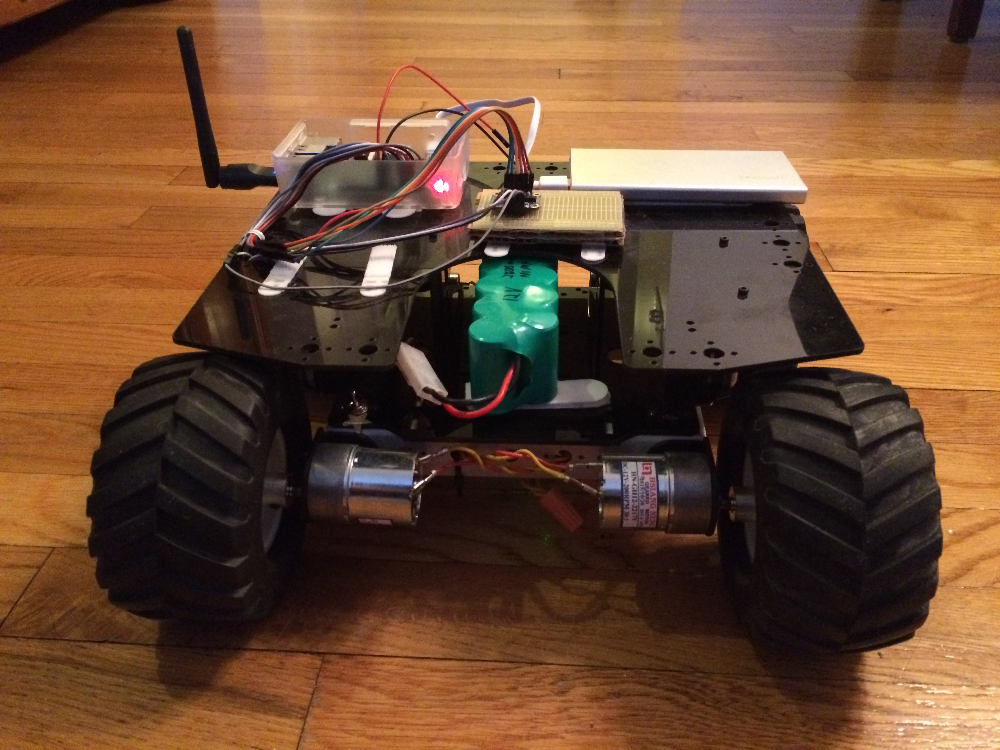

# nanibot
Code for the Nanigans robotics club and rover project
# Description
This code consists of two major sections:
* rover1: A collection of (mostly) python modules that are designed to be used collectively as the main application software that runs on a RaspberryPi computer, which is embedded on a small scale robotic car platform.  The specific robotic car platform on which the code was originally developed and tested, Rover1, is described below.  Additional explanation of code organization and usage is provided in the README at the top level of the rover1 directory.
* sandboxes: A loosely related set of scripts, Jupyter (IPython) notebooks, data sets, and other files that implement and document various experiments.  Many of the scripts and notebooks will execute completely independently of any other files in the repo, but others have very specific depenencies and are expected to be executed on the rover1 platform (as described below).  In most cases, documentation is included in the context and scope where dependencies must be understood. 
# Rover1
Rover1 is a small-scale, 4-wheel drive robotic car experimentation platform.  

The main computer is a Raspberry Pi 2, running a standard Raspbian OS, but with several required libraries install.  The required libraries are described below.

The main software is designed to be flexible enough to support a variety of peripheral devices.  Presently, the following devices are supported:
* Adafruit BNO055 absolute orientation IMU fusion breakout board (inertial measurement sensor)
* Dimension Engineering Sabertooth 2x12 motor driver
## Rover1 Pics

# Requirements
Summary of software requirements:
* Raspbian OS
* Python 2
  * virtualenv
  * virtualenvwrapper
  * Numpy
  * Pandas
  * SciPy
  * pigpio (see further explanation below)
  * smbus
  * Adafruit_BNO055 (BNO055)
* Adafruit_Python_BNO055 library and python interface
  * https://github.com/adafruit/Adafruit_Python_BNO055.git  
* pigpio library and interfaces
  * http://abyz.co.uk/rpi/pigpio/index.html
# License
MIT License

Copyright (c) 2017 Nanigans

Permission is hereby granted, free of charge, to any person obtaining a copy
of this software and associated documentation files (the "Software"), to deal
in the Software without restriction, including without limitation the rights
to use, copy, modify, merge, publish, distribute, sublicense, and/or sell
copies of the Software, and to permit persons to whom the Software is
furnished to do so, subject to the following conditions:

The above copyright notice and this permission notice shall be included in all
copies or substantial portions of the Software.

THE SOFTWARE IS PROVIDED "AS IS", WITHOUT WARRANTY OF ANY KIND, EXPRESS OR
IMPLIED, INCLUDING BUT NOT LIMITED TO THE WARRANTIES OF MERCHANTABILITY,
FITNESS FOR A PARTICULAR PURPOSE AND NONINFRINGEMENT. IN NO EVENT SHALL THE
AUTHORS OR COPYRIGHT HOLDERS BE LIABLE FOR ANY CLAIM, DAMAGES OR OTHER
LIABILITY, WHETHER IN AN ACTION OF CONTRACT, TORT OR OTHERWISE, ARISING FROM,
OUT OF OR IN CONNECTION WITH THE SOFTWARE OR THE USE OR OTHER DEALINGS IN THE
SOFTWARE.
